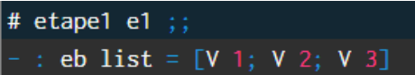
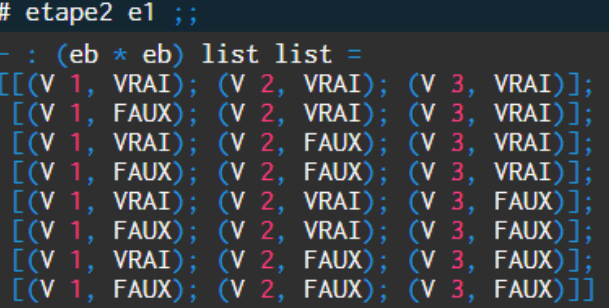
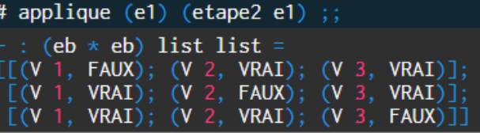

# Solveur Booléen

## Présentation du projet 

Ce projet a été réalisé lors de ma deuxième année de Licence informatique en Programmation Fonctionelle. 
L’objectif du devoir est de concevoir un solveur booléen en Ocaml dont le but
est de pouvoir calculer l’ensemble des solutions d’un système d’équation. L’algorithme de ce
solveur doit fonctionner en trois étapes. La première va permettre de déterminer l’ensemble
des variables du systèmes d'équations, la seconde va générer tous les environnements
possibles et enfin la dernière va faire une évaluation sur la satisfaction d’une équation
donnée par rapport à son membre de gauche et droite.
Le code a été realisé sur le site TryOcaml

## Présentation des structures de données et des algorithmes utilisés

Pour réaliser l’étape 1 de l’algorithme du solveur booléen, il a fallu d’abord commencer par
implémenter la fonction `concaténation` pour pouvoir faire la fonction `listevariable` car celle-ci va
devoir concaténer les listes de variables que nous pouvons donner.
Ensuite, nous avons implémenté deux fonctions, `partie_g` et `parti_d` qui vont permettre de
séparer la partie gauche et droite du système d’équation. Pour éliminer les possibilités
d’avoir des doublons lors de l’étape 1, nous avons aussi implémenté une fonction pour
s’occuper de ce cas où il a fallu en même temps redéfinir la fonction `appartenir` (déjà connus
dans le cours ) De plus, nous avons aussi implémenter la fonction `variable` qui consiste
simplement à récupérer les variables.
Avec toutes ces fonctions, nous avons pu ainsi faire celle de l’étape 1 de l’algorithme qui ce
nomme `etape_1`

Pour coder la l’étape 2 de l’algorithme, nous avons tout d’abord commencer par implémenter
une fonction `combi` qui va permettre de générer les possibilités ( voir jeux d’essais pour un
exemple ) puis une fonction `combine_liste` qui elle va pouvoir combiner les listes de couples
Ainsi, avec ces deux fonctions, nous avons pu finir l’étape 2 de l’algorithme en utilisant une
liste de l’étape 1 pour ensuite faire les combinaisons grâce aux fonctions précédentes.

Pour finir, il a fallu, pour la dernière étape de l’algorithme, étudier la satisfaction des
membres de gauche et de droite de la liste. Nous avons donc commencé par faire une
fonction `valeur_assos` pour trouver la valeur d’une variable ( V par exemple ) par rapport à son
environnement. Une fois terminé, il a fallu appliquer un environnement sur une équation
donnée ici grâce à la fonction `appliquer_env` qui remplace la valeur par le résultat de la table
de vérité. Ensuite, la fonction `equals` va regarder si les listes sont identiques pour, si c’est le
cas, voir une solution. Enfin, pour étudier la partie gauche ou droite du système d’équation,
nous avons implémenter la fonction `applique_sys` et pour finir la fonction `applique` qui va
permettre de résoudre le système

## jeux d'essais

